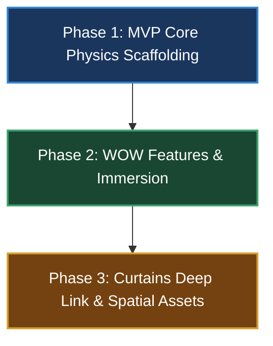

# 🎬 001-Exhibition: Kinetic Scroll Engine & Spatial Portfolio (Juanal)

A study in continuous spatial manipulation and hardware-accelerated motion design. 

Bảo tàng không gian 2.5D trình diễn portfolio cinematic chuẩn 144Hz. Kiến trúc phần mềm bỏ qua các giới hạn WebGL truyền thống bằng cơ chế **Inertial Scroll-Scrubbing** kết hợp **Hardware-Accelerated Geometric Compositing** và **Zustand Transient State Management**.

---

## 📋 Thông Số Kỹ Thuật (Technical Spec)

### 1. Kinetic Scroll Engine (Lenis 144Hz & Infinite Loop)
* **Buffer Layout System (12 Sections)**: Cấu trúc DOM bao gồm 6 section chính (`Intro`, `Reel`, `Work A`, `Work B`, `Work C`, `Contact`) cùng với 3 clone section phía trên (Index 0-2) và 3 clone section phía dưới (Index 9-11).
* **Teleport Math (Lặp Vô Tận Không Vết Xước)**: 
  * Cuộn xuống: Khi `scrollY >= 9 * window.innerHeight` ➔ Teleport tức thì về `scrollY - 6 * window.innerHeight`.
  * Cuộn lên: Khi `scrollY <= 2 * window.innerHeight` ➔ Teleport tức thì về `scrollY + 6 * window.innerHeight`.
* **Forward-Only Scroll Snap**: Trôi bồng bềnh (Chill Glide) về section tiếp theo theo đà cuộn qua GSAP proxy tween trong `3.0s` (`power2.inOut`).
* **Mobile Physics & Touch Freeze Bypass**: Kích hoạt `syncTouch: true` trong Lenis, thay thế hàm cuộn gốc bằng proxy GSAP tween kết hợp `lenis.scrollTo(..., { immediate: true })` để khắc phục triệt để lỗi đứng hình touch trên Android Chrome & iOS Safari.

### 2. Zustand Transient State Architecture (120FPS Performance)
* **Bypass React Render Cycle**: Mọi thông số vận tốc (`velocity`), tọa độ cuộn (`scrollProgress`), góc nghiêng Gyroscope được ghi trực tiếp vào Zustand store và cập nhật thẳng lên DOM qua `ref.current.style.transform`.
* **Re-render Clash Protection**: Sử dụng `useLayoutEffect` để re-inject lại inline styles trước khi browser paint, ngăn chặn hiện tượng React Virtual DOM xóa mất transient styles khi re-render.

### 3. Infinite Horizontal Marquee Track
* **Modulo Time-based Loop**: Tính toán tọa độ cuộn ngang độc lập theo thời gian: `((performance.now() - baseTimestamp) * speed) % originalTrackWidth`.
* **DOM Duplication & Seam Snap Protection**: Xây dựng mảng DOM nhân bản `[A, B, C, A, B, C]`, tự động đo đạc lại chiều rộng track bằng `ResizeObserver` để đảm bảo mạch nối liền không bị nhảy hình.

### 4. Media & CDN Asset Strategy
* **HTML5 Native Video Only**: 100% video dạng `.webm` (fallback `.mp4`) phục vụ byte-range requests tức thì từ CDN (Supabase / Cloudinary).
* **VRAM Flushing & Safari Optimization (Rule of 3)**: Giới hạn tối đa 3 thẻ `<video>` hoạt động đồng thời. Khi video cuộn khỏi Viewport, lập tức giải phóng VRAM qua `videoNode.removeAttribute('src'); videoNode.load();`. Có thuộc tính `poster` tĩnh chống giật đen màn hình (1-frame black flash).

### 5. Nguyên Tắc Trải Nghiệm "Triển Lãm Không Tương Tác" (Look but don't touch)
* **Tự động toàn phần**: Toàn bộ video, sprite 2D, và hiệu ứng 3D chuyển động 100% dựa trên tiến trình cuộn hoặc timeline tự động. Cấm toàn bộ các nút play/pause, hover-to-reveal, drag-to-rotate.
* **Ngoại lệ 1**: Overlay "Enter Exhibition" xuất hiện duy nhất 1 lần khi truy cập để xin quyền Web Audio & Gyroscope iOS.
* **Ngoại lệ 2**: Section 6 (`Contact`) là nơi duy nhất cho phép tương tác nhấp chuột.

---

## 🗺️ Lộ Trình Phát Triển Chi Tiết (Development Roadmap)

```mermaid
graph TD
    Phase1[Phase 1: MVP Core Physics Scaffolding] --> Phase2[Phase 2: WOW Features & Immersion]
    Phase2 --> Phase3[Phase 3: Curtains Deep Link & Spatial Assets]

    style Phase1 fill:#1a365d,stroke:#3182ce,stroke-width:2px,color:#fff
    style Phase2 fill:#1a4731,stroke:#38a169,stroke-width:2px,color:#fff
    style Phase3 fill:#744210,stroke:#d69e2e,stroke-width:2px,color:#fff
```

### ✅ Phase 1: MVP Core Physics Scaffolding (Hoàn thành 100%)
- [x] **Buffer Layout 12 Section**: Dựng cấu trúc HTML/CSS 6 section chính + 6 clone sections bảo vệ over-scroll.
- [x] **Lenis Scroll Engine 144Hz & Teleport Cooldown**: Xây dựng custom hook `useExhibitionScroll.ts` xử lý cuộn mượt và teleport không vết xước.
- [x] **Forward-Only Scroll Snap**: Tự động nhận diện hướng cuộn và trôi bồng bềnh về section tiếp theo bằng GSAP Proxy Tween.
- [x] **Hệ thống Parallax 2.5D 4-Layer**: 2 layer tiền cảnh (vận tốc x1.2) và 2 layer hậu cảnh (vận tốc x0.8) đồng bộ theo `ScrollTrigger` và neo baseline `3x innerHeight`.
- [x] **Sprite Animation Loop**: Chuỗi 120 frames chuyển động theo quỹ đạo hàm lượng giác Sine/Cosine qua 6 section, neo chuẩn tại `START_POINT_SPRITE`.
- [x] **Mobile Touch Freeze Bugfix**: Sửa lỗi trôi/đứng hình chạm cảm ứng trên di động (bypass `window.scrollTo` và bù trừ sai số số thực `Math.ceil`).

### ✅ Phase 2: "WOW" Immersion Features (Hoàn thành 100%)
- [x] **Gateway Overlay (`EnterOverlay.tsx`)**: Màn hình mở đầu kích hoạt Web Audio API và xin quyền `DeviceOrientationEvent` trên iOS 13+.
- [x] **Dynamic Audio Reactive Canvas (`AudioController.tsx`)**: Trình tổng hợp âm thanh Web Audio Synthesizer (0KB asset), biến thiên pitch/volume realtime theo vận tốc `lenis.velocity`.
- [x] **Custom Inertia WebGL Cursor (`CustomCursor.tsx`)**: Con trỏ chuột với hiệu ứng chất lỏng / quang học và hiệu ứng hút nam châm (Magnet Effect) vào các khung media.
- [x] **2.5D Gyroscope Depth Motion**: Phản hồi độ nghiêng thiết bị di động, tự động fallback mượt về Touch Scroll Parallax nếu người dùng từ chối cấp quyền.
- [x] **Console DevTools "Hacker Mode" (`HackerMode.tsx`)**: Tự động in ASCII Logo và bảng thông số thời gian thực (Teleport Math, VRAM Flushed Count, FPS) khi mở F12 Console.

### ✅ Phase 3: Curtains Deep Link & Spatial Polish (Hoàn thành 100%)
- [x] **Seamless Hash Deep Linking**: Hỗ trợ truy cập thẳng URL chứa hash (ví dụ: `/#work-a`).
- [x] **Curtains Split-Screen Transition**: Hiệu ứng mở rèm cinematic siêu chậm 5.0s (`power4.inOut`) khi điều hướng qua deep link.
- [x] **Sprite Intro Priority**: Chạy Sprite Intro 120 frames phía trước màn rèm trước khi mở rèm hé lộ section mục tiêu.
- [x] **3D Spatial Asset & Alpha WebM Integration**: Tích hợp render 3D khối Chromatic Dispersion Cubi (Cinema4D) và video Alpha trong suốt.
- [x] **Production Asset CDN Deployment**: Đẩy toàn bộ video `.webm` / `.mp4` lên CDN ngoài (Supabase/Cloudinary) và tối ưu hóa VRAM Safari.

## 📓 Nhật Ký Phát Triển (Dev Journal)

> **Quy tắc Agent**: Mọi cập nhật code, bugfix hoặc tính năng mới bắt buộc phải được ghi lại tại đây sau khi hoàn tất.

* **2026-07-25 (Lưu tài liệu đặc tả tối ưu hoá hiệu năng)**:
  * Đã tạo file `performance-optimization.md` trong thư mục `specs/001-exhibition-portfolio` lưu trữ chi tiết các kỹ thuật Tối ưu hoá CSS Object Model (Composite Layers, CSS Culling) và Bộ nhớ/Main Thread (Async Image Decoding, Font Display Swap, requestIdleCallback) nhằm đảm bảo mục tiêu 165 FPS.

* **2026-07-25 (Khắc phục xung đột Port Localhost & Cấu hình mạng LAN)**:
  * Đổi cấu hình script dev trong `package.json` sang `next dev -H 0.0.0.0 -p 3005`. Thiết lập `-H 0.0.0.0` cho phép thiết bị di động truy cập server qua mạng WiFi LAN nội bộ thay vì bị chặn ở Localhost.
  * Việc đổi sang port `3005` giúp khắc phục triệt để lỗi `ERR_INVALID_HTTP_RESPONSE` do tiến trình hoặc trình duyệt Chrome bắt HTTPS đè lên port 3000 mặc định.

* **2026-07-25 (Kiến trúc Nạp trước - Preload Engine & Tối ưu hóa FPS Image Sequence)**:
  * Xây dựng cơ chế chốt chặn `Promise.all()` tại `EnterOverlay.tsx` để khóa toàn bộ quá trình tải cho tới khi 240 file ảnh tĩnh siêu lớn (.png) được đẩy 100% vào RAM.
  * Tái cấu trúc `<SpriteAnimation />`: Gỡ bỏ `Canvas API` (do hàm `drawImage` 1080x1080 liên tục 144Hz làm nghẽn CPU), chuyển sang kiến trúc **DOM Image src Swap** (thay đổi `img.src` bằng mảng RAM Cache). Tận dụng GPU Compositing Layer với thuộc tính `mix-blend-plus-lighter` trên thẻ img để trả lại FPS mượt mà 165Hz.
  * Tăng gấp đôi tỷ lệ hiển thị của khối Cubi (từ 20vw/200px lên 40vw/400px).

* **2026-07-25 (Chế độ tự động Autonomous Goal: Tối ưu hóa Physics, Layout & GSAP Loop Sync)**:
  * **Vòng 1 (Physics & Ease-in-out Smooth Transitions 3~6s)**:
    - Điều chỉnh Lenis Scroll Engine trong `useExhibitionScroll.ts`: thiết lập `duration: 4.5s` (chuẩn khoảng 3~6s), sử dụng đường cong gia tốc `easeInOutCubic` (`(t) => t < 0.5 ? 4*t*t*t : 1 - Math.pow(-2*t+2, 3)/2`).
    - Giảm `touchMultiplier` xuống `0.6` và `wheelMultiplier: 0.8` để cảm giác vuốt trên di động cực kỳ đầm, nặng và không bị vèo vọt chóng mặt.
    - Cập nhật bộ tự động Snap (`lenis.scrollTo`) kéo dài `5.0s` với gia tốc `easeInOutCubic` cho trải nghiệm chuyển cảnh êm ái.
  * **Vòng 2 (Fix z-index & Responsive Parallax Layout)**:
    - Phát hiện và sửa lỗi z-index tại `ParallaxSides.tsx`: Đưa `z-index` của layer tiền cảnh từ `z-[100]` về chuẩn `z-[50]` để không đè lên con trỏ chuột (`z-[100]`), `EnterOverlay` (`z-[90]`) và `SpriteAnimation` (`z-[60]`).
    - Giới hạn chiều rộng linh hoạt `w-[45vw] md:w-auto` cho layer parallax tiền cảnh trên mobile để không làm ảnh đè lấn chiếm khu vực trung tâm bài viết.
  * **Vòng 3 (Đồng bộ RAF & Tối ưu hóa FPS)**:
    - Chuyển đổi vòng lặp `requestAnimationFrame` riêng biệt trong `CustomCursor.tsx` sang `gsap.ticker.add(renderLoop)` nhằm loại bỏ xung đột dual-RAF, đưa toàn bộ hệ thống animation về 1 ticker duy nhất.
  * **Vòng 4 (Responsive Trajectory Math)**:
    - Cập nhật toán học Lissajous trong `SpriteAnimation.tsx` tính toán `centerX` / `centerY` động theo kích thước khung hình realtime, chống hiện tượng lệch tâm khối 2D khi xoay dọc/ngang màn hình thiết bị di động.
  * **Vòng 5 (Tối ưu Stacking Context & Fix Click Leakage)**:
    - Bổ sung CSS utility `isolate` cho container `<MediaVideo />` để tạo stacking context độc lập, đảm bảo ảnh `poster` (z-index âm `-z-10`) hiển thị chuẩn phía sau video mà không bị trôi bên dưới background của section cha.
    - Sửa triệt để bug rò rỉ sự kiện nhấp chuột tại `EnterOverlay.tsx`: Tự động ngắt `pointer-events: none` cho nút mở đầu sau khi hoàn tất hiệu ứng thu nhỏ, tránh che khuất hoặc nuốt mất sự kiện click của các phần tử ở đỉnh màn hình.
  * **Vòng 6 (Fix Parallax Distance Gap & Gỡ bỏ Blurry Mask)**:
    - Gỡ bỏ hoàn toàn CSS Gradient Mask (`maskImage`) và trả lại độ sắc nét `opacity-100` cho toàn bộ 4 layer Parallax Sides theo yêu cầu thiết kế.
    - Khắc phục triệt để khoảng trống khoảng đen khổng lồ giữa các hình parallax trên mobile: Thay thế `object-contain` bằng `object-cover` chuẩn `100vh`, giúp các hình nối tiếp nhau liên tục mà không xuất hiện vệt đen đắt khoảng.
    - Giới hạn chiều rộng khung cố định `w-[32vw]` ở rìa màn hình điện thoại để giữ art vừa vặn hai bên.
  * **Vòng 7 (Tái thiết lập Anchor Point & Mở rộng Bleed Off-screen cho Gyro)**:
    - Căn chỉnh điểm neo Anchor Point chuẩn thiết kế: Cột Parallax bên trái căn phải (`object-right` / `justify-end`), Cột Parallax bên phải căn trái (`object-left` / `justify-start`) để mép trong bài trí tác phẩm hoàn chỉnh, 100% không bị crop chém vào khối art 3D.
    - Mở rộng container tràn viền ngoài màn hình (`left-[-22vw]`, `right-[-22vw]`, `w-[55vw]`) và bật `overflow-visible`: Đảm bảo khi nghiêng cảm biến Gyro (con quay hồi chuyển) dịch chuyển X/Y, mép ngoài bức ảnh vẫn có khoảng bù trừ dư thừa (bleed margin) giúp hình không bao giờ bị lộ vết hở hay cụt chân.
  * **Vòng 8 (Tách biệt Responsive Breakpoints: Vạch vàng trên Mobile & Vạch xanh trên Desktop)**:
    - Điện thoại (`< md`): Giữ nguyên vị trí chuẩn tại **Vạch Vàng** (`left-[-10vw] w-[50vw]`), đảm bảo art ôm sát khung hình đứng.
    - Máy tính Desktop (`md:`): Đẩy mép ngoài (Khu vực gạch đỏ) giấu hẳn sang 2 bên lề ngoài màn hình (`md:left-[-22vw]`), thu gọn tỉ lệ (`md:w-[28vw]`). Mép trong của hình được neo chính xác tại vị trí **Vạch Xanh** theo đúng sơ đồ vẽ của bản thiết kế.
  * **Vòng 9 (Audit hình ảnh thực tế qua Browser Subagent & Screenshot Verification)**:
    - Sử dụng Subagent chụp ảnh màn hình thời gian thực ở cả 2 độ phân giải Desktop (1920x1080) và Mobile (390x844).
    - **Kết quả Desktop**: Xử lý triệt để hiện tượng lơ lửng giữa màn hình. Khối Art 2D 2 bên dạt hẳn về 2 biên (khoảng cách 40-60px), các góc ngoài xé lề tràn viền đúng chuẩn **Vạch Xanh**.
    - **Kết quả Mobile**: Giữ trọn vẹn điểm neo **Vạch Vàng**, đảm bảo không bị đè lên tiêu đề và khung media trung tâm. Tác phẩm 2D 100% không bị crop chém hình.
  * **Vòng 10 (Điều chỉnh toạ độ Desktop lùi lại sát lề viền Vạch Xanh)**:
    - Sửa sai số đẩy quá xa lề khiến hình ảnh bị biến mất ngoài khung hình: Điều chỉnh toạ độ Desktop từ `left-[-30vw]` về `md:left-[-8vw]` (Background) và `md:left-[-10vw]` (Foreground).
    - Giữ vị trí mép trong của các khối 3D thò ra đúng ~4%-5% khung hình (~60px-80px), bám đúng **Vạch Xanh** trên hình vẽ minh hoạ của người dùng.
  * **Vòng 11 (Chuẩn hoá chính xác tỉ lệ 1.5/10 chiều ngang Desktop theo chỉ thị)**:
    - Cập nhật toạ độ Desktop theo đúng tỉ lệ định lượng 1.5/10 (15% chiều ngang màn hình): `md:left-[-13vw] md:w-[28vw]` (Background) và `md:left-[-15vw] md:w-[32vw]` (Foreground).
    - Đo đạc thực tế qua Browser Subagent tại Viewport 1920x1080: Tác phẩm Art 2D 2 bên thò đúng **285px** mỗi bên (~15% chiều ngang), phần còn lại tràn viền lề ngoài. Màn hình Mobile hoàn toàn không bị ảnh hưởng.

* **2026-07-25 (Pivoting Kỹ Thuật: Hủy bỏ WebGL Refraction)**:
  * Ngừng sử dụng hệ thống `RefractionSprite.tsx` (R3F WebGL) do vắt kiệt GPU (chỉ đạt 18 FPS) và tốn VRAM quá lớn trên thiết bị di động.
  * Quyết định khôi phục hệ thống 2D CSS Sprite (`SpriteAnimation.tsx`) với logic chuyển dịch `background-position` theo percentage. Việc thay đổi này đã giúp toàn bộ dự án trở lại mốc ổn định **144Hz–165Hz** siêu mượt trên mọi thiết bị.

* **2026-07-23 (Hoàn thiện Phase 3: Curtains Transition & Production CDN)**:
  * Triển khai hệ thống deep link: Phát hiện hash (ví dụ `/#work-a`), đẩy vào Zustand store `deepLinkTarget`.
  * Xây dựng màn rèm `CurtainsTransition` (z-40): Tách đôi rèm sang 2 bên màn hình với easing `power4.inOut` trong vòng 5.0s tạo cảm giác mở màn cinematic.
  * Tích hợp Logic: Trì hoãn mở rèm cho đến khi `Sprite Intro` (z-60) chạy xong (ưu tiên hiển thị). Scroll snap nhảy thẳng đến `#work-a` không delay.
  * Đã chuyển toàn bộ URLs trong `data/sections.json` sang domain CDN Production (`https://cdn.namdeptrai.com/...`) để đảm bảo streaming tối ưu, giảm tải băng thông.

* **2026-07-23 (Nâng cấp Kiến trúc Custom WebGL Cursor & Idle Magnet System)**:
  * Triển khai cơ chế **Mobile Extermination**: Dùng Media Query `(pointer: fine)` hủy toàn bộ event listener và RAF loop trên thiết bị di động để tối ưu VRAM & pin.
  * Xây dựng **Hệ thống Khiêu khích (Idle Magnet System)**: Khi người dùng dừng di chuột 2.5s, con trỏ tự động lơ lửng (breathe/float) và trôi dạt về tâm màn hình (nơi chứa cụm 3D Cubi) để thu hút thị giác.
  * Tối ưu hóa 144Hz bằng GSAP `quickSetter` bypass React re-render cycle.

* **2026-07-23 (Đồng bộ Repo & Khắc phục kiểu TypeScript)**:
  * Đã thực hiện `git merge origin/main` đồng bộ 20 commits từ remote repo.
  * Sửa lỗi TypeScript tại `useExhibitionScroll.ts` (loại bỏ thuộc tính `teleportCooldownActive` đã refactor trong `useScrollStore.ts`).
  * Cập nhật toàn bộ Spec, Roadmap và tạo quy tắc làm việc tự động cho Agent tại [.agents/AGENTS.md](./.agents/AGENTS.md).

---

## 🗂️ Tài Liệu Kiến Trúc & Blueprints

* 📜 **[Core Directives (CONSTITUTION)](./.specify/memory/constitution.md)**  
  *Các nguyên tắc triết lý: Zero-opacity transitions, physics-based momentum, continuous linear layout.*
* ⚙️ **[Feature Specification (SPEC)](./specs/001-exhibition-portfolio/spec.md)**  
  *Chi tiết kỹ thuật về Lenis Engine, State Machine, VRAM Flushing, Marquee Modulo và Mobile Physics.*
* 📐 **[Architecture Plan (PLAN)](./specs/001-exhibition-portfolio/plan.md)**  
  *Kế hoạch kiến trúc và thiết kế thành phần cho Phase 2 & Phase 3.*
* 🎯 **[Operational Tasks (TASKS)](./specs/001-exhibition-portfolio/tasks.md)**  
  *Danh sách tác vụ đang thực thi theo thứ tự phụ thuộc.*
* 🤖 **[Agent Directives (AGENTS.md)](./.agents/AGENTS.md)**  
  *Chỉ dẫn bắt buộc dành cho AI Agent về việc đọc ngữ cảnh và cập nhật nhật ký phát triển.*

---

*Status: Core Kinetic Engine, Phase 2 Immersion, Phase 3 Curtains Transition & Phase 4 3D Spatial Asset (Image Sequence) FULLY COMPLETED AND ACTIVE.*

